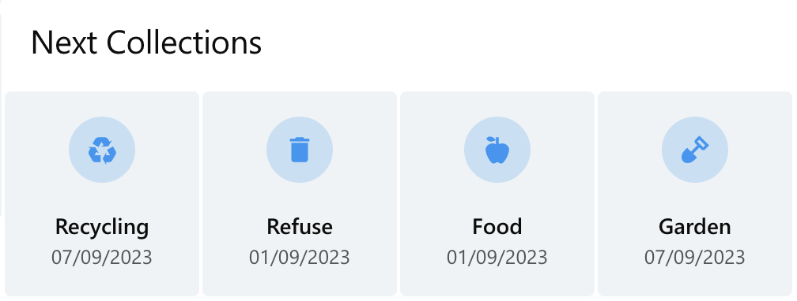

# Home Assistant - St Albans Rubbish Collection


[](https://github.com/hacs/integration)

This is a simple integration to pull rubbish collection information from St Albans Council's [notice board](https://gis.stalbans.gov.uk/NoticeBoard9/NoticeBoard.aspx). 



The screenshot uses the [Mushroom Entity widget](https://github.com/piitaya/lovelace-mushroom) and the [Metrology theme](https://github.com/Madelena/Metrology-for-Hass).

# Installation

## Via [HACS](https://hacs.xyz)

[](https://my.home-assistant.io/redirect/hacs_repository/?owner=jshiell&repository=homeassistant-stalbansrubbishcollections)

Or:

1. Open the HACS panel in your Home Assistant frontend.
1. Click the three dots in the top-right corner and select "Custom Repositories".
1. Add a new custom repository:
    * URL: jshiell/homeassistant-stalbansrubbishcollections
    * Category: Integration
1. Click "Save" and then click "Install" on the integration.

## Manually

1. Clone this repository.
1. Copy `custom_components/stalbansrubbishcollections` into your `config/custom_components` directory.
1. Restart Home Assistant.

# Configuration

1. [Find your UPRN](https://www.findmyaddress.co.uk/)

3. Add the integration, providing your UPRN.

You'll need some sensors to expose the state:

```yaml
template:
  - sensor:
     - unique_id: rubbish_recycling_next
       state: "{{as_timestamp(state_attr('sensor.stalbans_rubbish_collection_<your uprn>', 'CollectDomesticRecycling')['next']) | timestamp_custom('%d/%m/%Y') }}"
       attributes:
         friendly_name: "Next recycling collection date"
  - sensor:
     - unique_id: rubbish_recycling_last
       state: "{{as_timestamp(state_attr('sensor.stalbans_rubbish_collection_<your uprn>', 'CollectDomesticRecycling')['last']) | timestamp_custom('%d/%m/%Y') }}"
       attributes:
         friendly_name: "Last recycling collection date"
  - sensor:
     - unique_id: rubbish_refuse_next
       state: "{{as_timestamp(state_attr('sensor.stalbans_rubbish_collection_<your uprn>', 'CollectDomesticRefuse')['next']) | timestamp_custom('%d/%m/%Y') }}"
       attributes:
         friendly_name: "Next refuse collection date"
  - sensor:
     - unique_id: rubbish_refuse_last
       state: "{{as_timestamp(state_attr('sensor.stalbans_rubbish_collection_<your uprn>', 'CollectDomesticRefuse')['last']) | timestamp_custom('%d/%m/%Y') }}"
       attributes:
         friendly_name: "Last refuse collection date"
  - sensor:
     - unique_id: rubbish_food_next
       state: "{{as_timestamp(state_attr('sensor.stalbans_rubbish_collection_<your uprn>', 'CollectDomesticFood')['next']) | timestamp_custom('%d/%m/%Y') }}"
       attributes:
         friendly_name: "Next food waste collection date"
  - sensor:
     - unique_id: rubbish_food_last
       state: "{{as_timestamp(state_attr('sensor.stalbans_rubbish_collection_<your uprn>', 'CollectDomesticFood')['last']) | timestamp_custom('%d/%m/%Y') }}"
       attributes:
         friendly_name: "Last food waste collection date"
  - sensor:
     - unique_id: rubbish_garden_next
       state: "{{as_timestamp(state_attr('sensor.stalbans_rubbish_collection_<your uprn>', 'CollectDomesticPaidGarden')['next']) | timestamp_custom('%d/%m/%Y') }}"
       attributes:
         friendly_name: "Next garden waste collection date"
  - sensor:
     - unique_id: rubbish_garden_last
       state: "{{as_timestamp(state_attr('sensor.stalbans_rubbish_collection_<your uprn>', 'CollectDomesticPaidGarden')['last']) | timestamp_custom('%d/%m/%Y') }}"
       attributes:
         friendly_name: "Last garden waste collection date"
```
